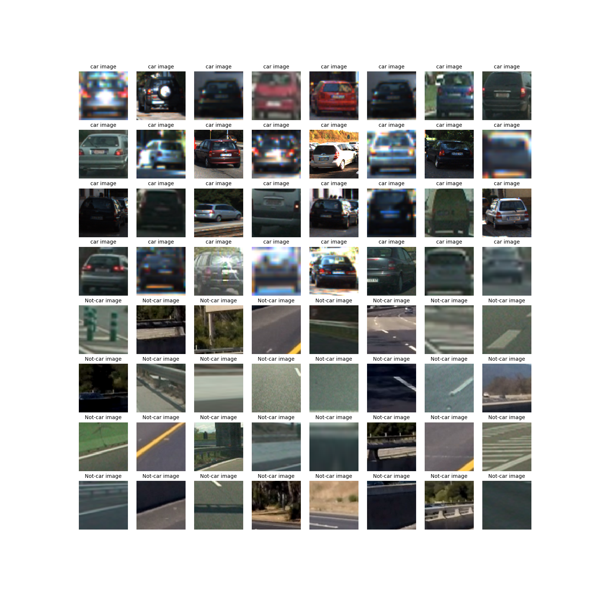
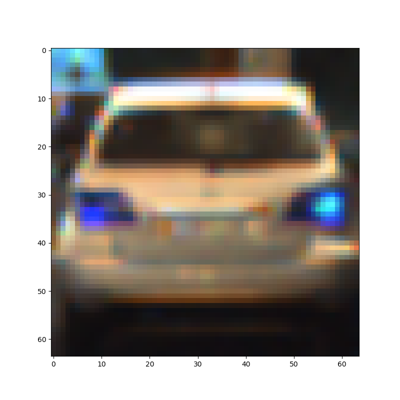
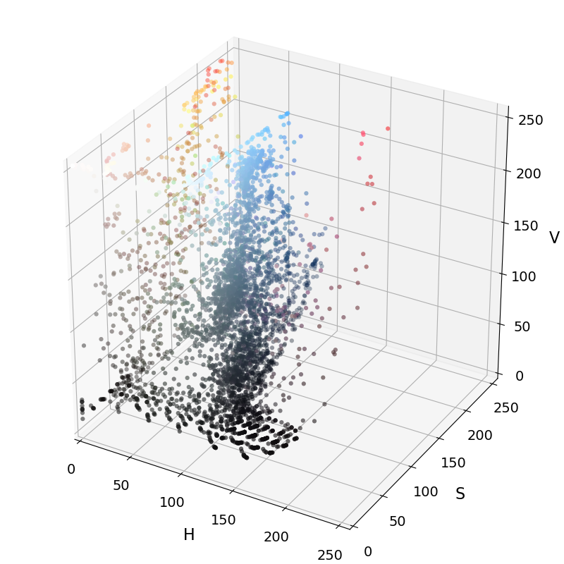
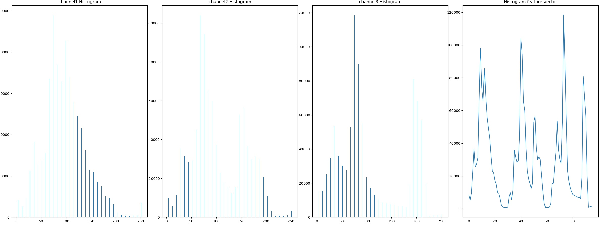
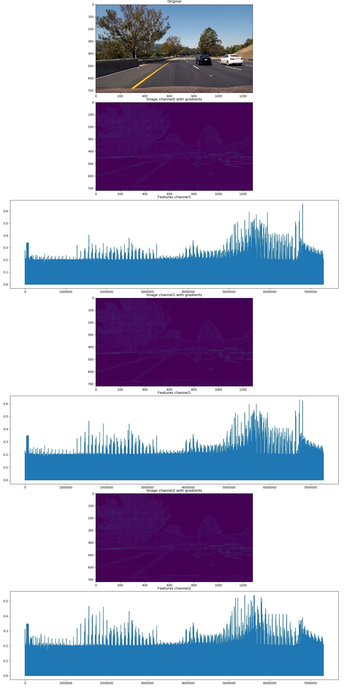
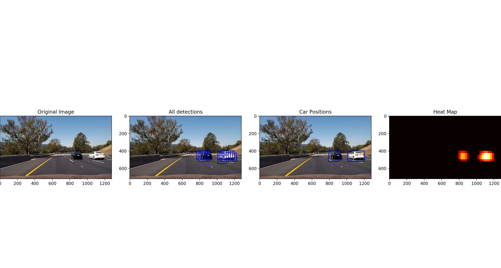
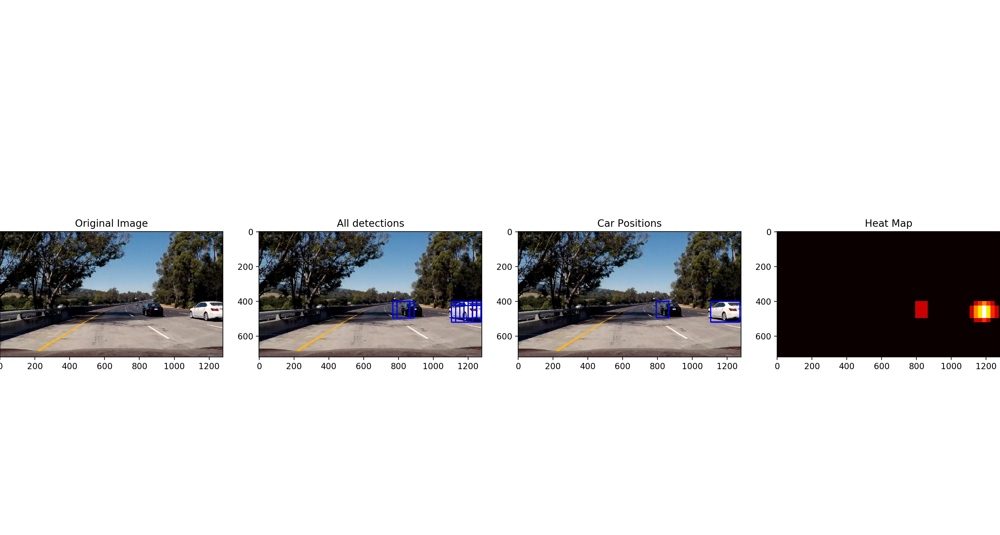

## Vehicle Detection Project

This project showed us how to use the **classic** Computer Vision techniques to classify and label cars on the road. In a nutshell, we trained a classifier algorithm to identify cars. The input features are based on color and gradient (HOG) information. We then run a sliding window search across a region of the image and use the classifier to classify cars within each window.

The image processing pipeline consists of the following steps:

* Perform a Histogram of Oriented Gradients (HOG) feature extraction to get the shape charateristics
* Apply a color transform and calculate binned color features, as well as histograms of color to get the color characteristics
* Concatenate the HOG, spatial and histogram vectors to get the final feature vector.

The detection pipeline consists of the following steps

* Perform a sliding-window technique and use the trained classifier to search for vehicles in images.
* Create a heat map of recurring detections frame by frame to reject outliers and follow detected vehicles.
* Smoothen the detections in the video by taking a rolling weighted average of the detections.
* Estimate a bounding box for vehicles detected.

## Feature engineering

I started by loading the `vehicle` and `non-vehicle` images. An example of a random subset of each of the `vehicle` and `non-vehicle` classes:

The code that loads the data is here: [features.py L155-L156](https://github.com/arrawatia/CarND-Vehicle-Detection/blob/master/features.py#L155-L156)

### Color Spaces
I then explored different color spaces on a random subset of images from both `vehicle` and `non-vehicle` classes and settled on the **HSV** color space. This colorspace had the best separation of colors along the **H** axis.

An example of the plots for an image is shown below.

The rest of the plots are here: [colorspace plots](output_images/plots/colorspace/)

The code that transforms the colorspace is here [features.py L5-L13](https://github.com/arrawatia/CarND-Vehicle-Detection/blob/master/features.py#L5-L13) and the code that produces the plots is here `features.py` [L120-L145](https://github.com/arrawatia/CarND-Vehicle-Detection/blob/master/features.py#L120-L145) [L187-L249](https://github.com/arrawatia/CarND-Vehicle-Detection/blob/master/features.py#L187-L249).

### Channel Histograms

I then looked at the distribution of pixel colors by plotting the channel histograms to get a color **signature** of the cars. I looked at the histograms for a sample of cars and non-cars. I also plotted the histograms for the test images.

A sample from one the test images is show below

The rest of the plots are here: [histogram plots](output_images/plots/hist)

The code that computes the histogram is here: [features.py L45-L53](https://github.com/arrawatia/CarND-Vehicle-Detection/blob/master/features.py#L45-L53) and the code that produces the plots is here [features.py L252-L275](https://github.com/arrawatia/CarND-Vehicle-Detection/blob/master/features.py#L252-L275).

### Spatial binning

Spatial binning allows us tp collect the image pixels in a feature vector. It is inefficient to include all three color channels of a full resolution image.  Spatial binning lumps close pixels together to form a lower resolution image. This image is then flattened into an vector.

An example of spatial binning for one the test images is shown below

The rest of the plots are here: [spatial binning plots](output_images/plots/spatial)

The code that performs the spatial binning is here: [features.py L38-L42](https://github.com/arrawatia/CarND-Vehicle-Detection/blob/master/features.py#L38-L42) and the code that produces the plots is here [features.py L277-L294](https://github.com/arrawatia/CarND-Vehicle-Detection/blob/master/features.py#L277-L294).

### HOG

The gradients in a specific direction in reference to the center of the object image will give us the **shape** signature of objec.

We use the Histogram of Oriented Gradients (HOG) method to compute the gradients. scikit-image has an implementation in `skimage.hog()` from  to execute it. The function takes in a single color channel or grayscaled image as input.
I tried a few parameter combinations (`orientations`, `pixels_per_cell`, and `cells_per_block`) on the test images and random images from each of the two classes to understand how this works.

An example of HOG feattures on one of the test images using HOG parameters of `orientations=9`, `pixels_per_cell=8` and `cells_per_block=8` for each channel:

The rest of the plots are here: [HOG plots](output_images/plots/hog)

The code that calculates the HOG features is here: [features.py L16-L35](https://github.com/arrawatia/CarND-Vehicle-Detection/blob/master/features.py#L16-L35) and the code that produces the plots is here [features.py L296-L332](https://github.com/arrawatia/CarND-Vehicle-Detection/blob/master/features.py#L296-L332).

## Training the classifiers

I trained two classifiers.

1. Linear SVM
2. Random Forest

I chose to try atleast two algorithms and both were able to perform very well on the test set without much tuning.

The code for the model and training is here: [model.py](https://github.com/arrawatia/CarND-Vehicle-Detection/blob/master/model.py#L77-L130)

I first transformed the image to HSV color space and processed the resulting image to get the following features.

* HOG Features
* Binned histogram features
* Spatial features

The feature vectors were normalized to deal with the difference in magnitude of concatenated features. The unbalanced number of features between spatial binning, the histogram of colors and HOG, were minimized by dropping the features that were not significant. I used the `StandardScaler()` method, from Python's sklearn package to do this.

The code that does the processing of features is here [model.py L28-L74](https://github.com/arrawatia/CarND-Vehicle-Detection/blob/master/model.py#L28-L74)

The variables for calculating these features are here : [model.py L134-L146](https://github.com/arrawatia/CarND-Vehicle-Detection/blob/master/model.py#L134-L146)

### Sliding Window Search

I used the efficient HOG sub-sampling window search method. This method has to extract hog features once, for each of a small set of predetermined window sizes (defined by a scale argument), and then can be sub-sampled to get all of its overlaying windows. Each window is defined by a scaling factor that impacts the window size.

I used a 64 x 64 base window size with an overlap of 2. This results in an overlap of 75% with the previous window.

The code that performs this search is here [classify.py L57-L164](https://github.com/arrawatia/CarND-Vehicle-Detection/blob/master/classify.py#L57-L164) .

I built an heatmap from the detections to **combine overlapping detections and remove false positives**.
The code that performs this heatmap calculations is here `classify.py` [L22-L53](https://github.com/arrawatia/CarND-Vehicle-Detection/blob/master/classify.py#L22-L53) [L167-L189](https://github.com/arrawatia/CarND-Vehicle-Detection/blob/master/classify.py#L167-L189).

Some examples of window search and using heatmap to remove false positives on the test images is shown below.

The rest of the plots are here: [search plots](output_images/plots)

## Video Implementation

I used both classifiers and here are the resulting videos. Based on a suggestion from one of fellow students, I used weighted averaging of detections over the last 10 windows. It made the video processing smooth and accurate.

1. [SVM](output_videos/svc-project_video.mp4)
2. [Random Forest](output_videos/rf-project_video.mp4)

The code that processes video is here : [movie.py](https://github.com/arrawatia/CarND-Vehicle-Detection/blob/master/movie.py)

## Discussion

These techniques require a lot of hyperparameter search. I would want to do a more structured search for the hyperparameters.

The pipeline is also very sensitive to changes in the road and the lighting conditions. I would like to make it robust to these changes.

After working through the CNN projects, I have come to appreciate how much easier it is to train the NN compared to these techniques. I would like to try them to solve this problem.
